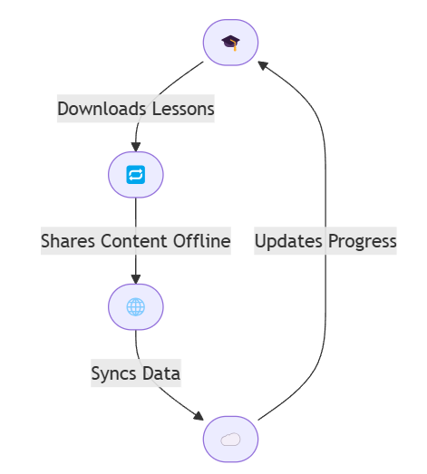
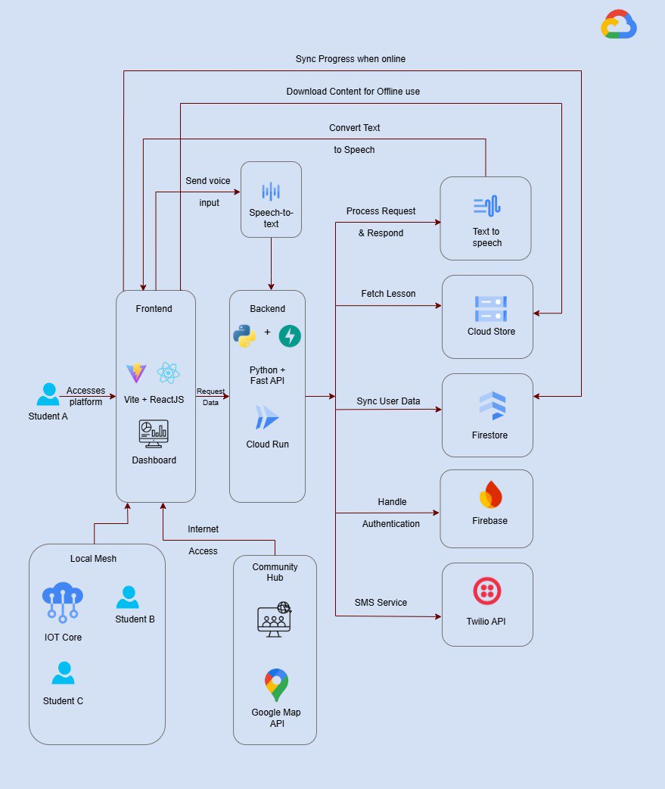

## Pragati - Empowering Rural India Through Accessible Learning

### 🔴The Problem
65-70% of children (ages 5-15) in rural India, especially in J&K, UP, Bihar, Rajasthan, and the North-East, lack quality education due to:
 1. Minimal interactive teaching & structured curriculum.
 2. Poor learning environments & untrained teachers.
 3. Limited or no internet access for self-learning. Also, no clear guidance on what or how to study.

### ⚠️ Result?
Even motivated students struggle, limiting their future opportunities.

### Our Solution: Pragati
 A low-bandwidth, offline-first learning platform designed for rural students with minimal internet access, offering high-quality education
 anytime, anywhere. It bridges the digital divide, ensuring every child in rural India gets the education they deserve.

### Key Features

1. **Offline-First Learning**  
Students can download lessons at community centers/schools & study offline.

2. **Voice-Based Interface**  
Support for multiple Indian languages with text-to-speech and speech-to-text capabilities, making education accessible to students with varying literacy levels.

3. **Peer-to-Peer Knowledge Sharing**  
Local mesh networks allowing students to share downloaded materials with peers without internet connectivity.

4. **Low-Data Consumption Mode**  
Optimized content delivery using progressive loading of educational resources to minimize data usage.

5. **SMS-Based Learning Extensions**  
Deliver quiz questions, vocabulary words, and small knowledge nuggets via SMS for students without smartphones.

6. **Community Learning Hubs**  
Map nearby physical locations with reliable internet access where content can be downloaded to a shared device.

### Tech Stack

**Frontend**: Vite + ReactJS  
**Backend**: Python + FastAPI  
**Cloud**: GCP (Cloud Storage, Firestore, Firebase, Text-to speech, Speech-to-text, IOT core, Google Maps API, Cloud Run, Twilio API)  
**Deployment**: Google App Engine, Vercel

[Subject to modifications👆🏻]

### User Flow

### Architecture

### UI (Figma Preview)

[Click to view](https://www.figma.com/proto/YWgkillSyTKhsZ2wVhcuSb/Untitled?node-id=1-2&t=7mMhk02TVvS7DhSm-1&scaling=scale-down&content-scaling=fixed&page-id=0%3A1&starting-point-node-id=1%3A2&show-proto-sidebar=1)

### Project Analysis

 **Technical Feasibility**: The platform utilizes existing technologies and available resources for implementation.  

 **Financial Feasibility**: Development and maintenance can be funded through government support, private investment, and NGO & anaganwadi
 partnerships.  

 **Social Feasibility**: Fulfills a critical need in rural India, ensuring wide adoption.

### Challenges and Risks

 **Limited Internet Access**: Irregular connectivity in
 remote areas.  

 **Device Availability**: Not all students own smartphones.  

 **Content Development**: Need for multilingual and culturally relevant content.

  **Teacher Training**: Training teachers to effectively utilize the platform is crucial for its success.

### Solutions

 **Internet Access**: Partner with telecom companies for affordable
 data packs.  

 **Device Access**:  Use shared devices at Community Hubs (schools,
 libraries).  

 **Content Creation**: Crowdsource content with local teachers and
 NGOs.

  **Government Support**: Seek government funding and support
 for device distribution and teacher training.

